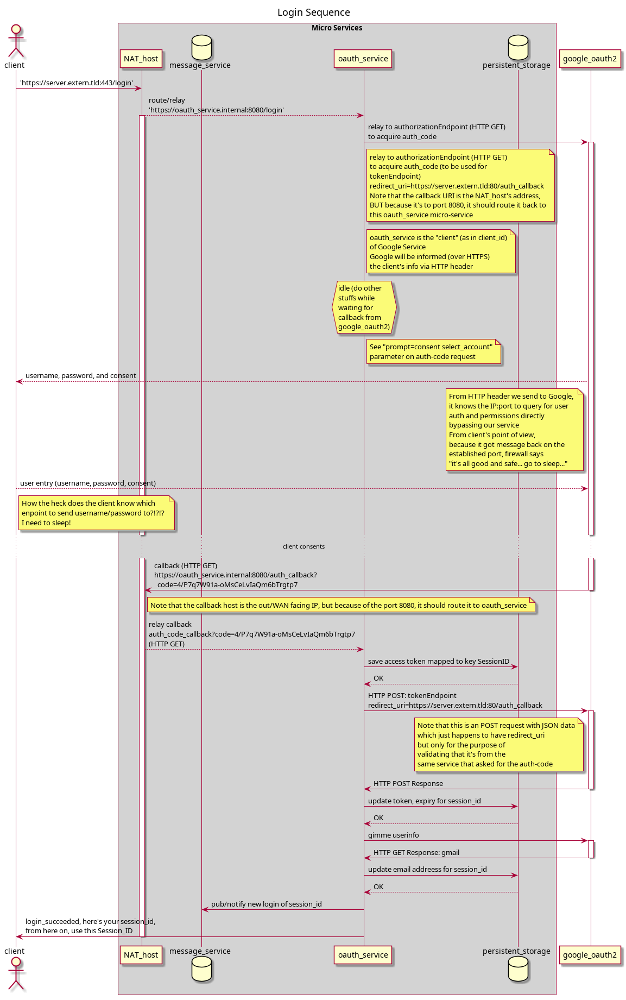
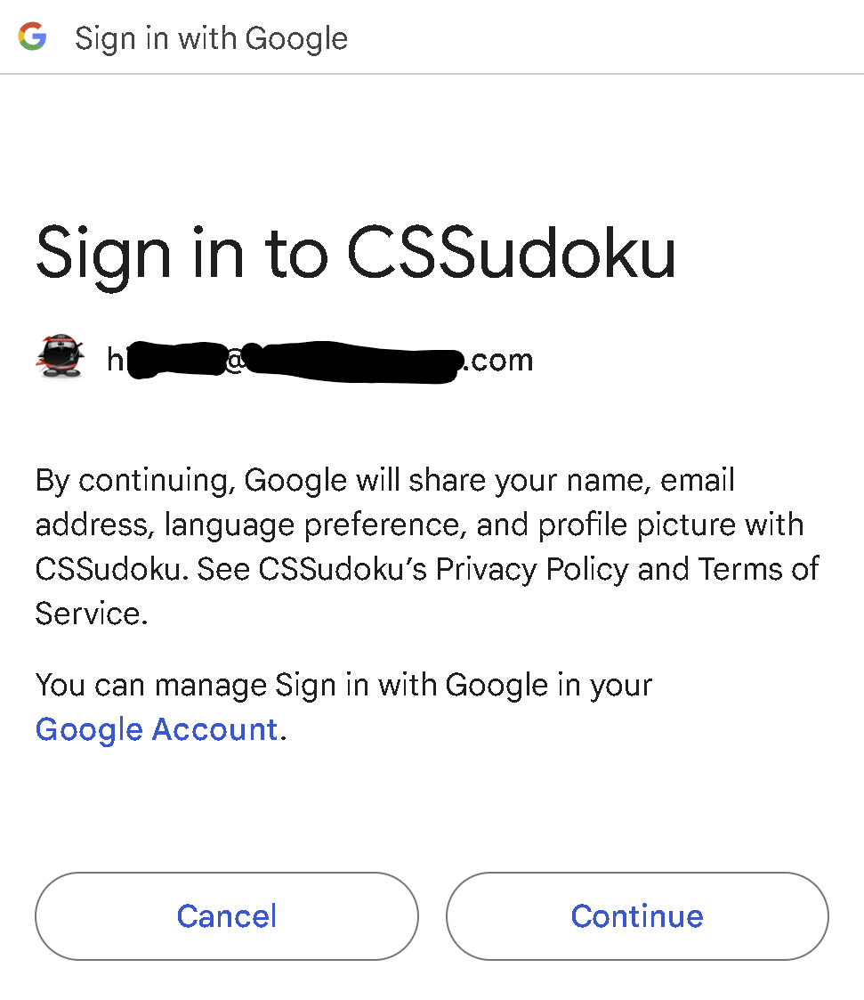
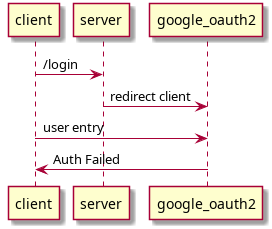
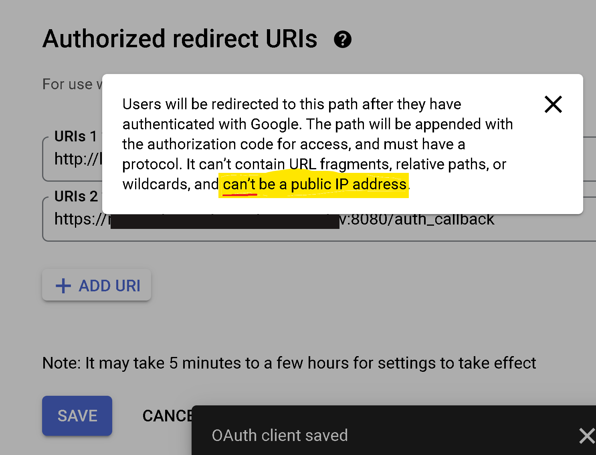

# Google OAUTH2 relay/proxy service

Suppose you want to integrate user-based system so that when the player quits playing sudoku in the middle of the game and continue on from where they've left off, one needs to actually associate a session ID or token for that user to pull the last known state.

Note that if it is a single-player game, the auth is really unnecessary, all we need to assume is that every connection is from the same user, even if the IP address changed since the last access.

But if it has to deal with more than single player, we do need to some how associate/map user to persisted-states. We'll be using Google OAUTH2 service as our authenticator. Nice thing about this service is that until the authorization token expires, that session should be valid in terms of trusting that the player says who she is, is who she really is.

In the old days, all we had to do was store the username and their session ID in a database accounting table, and be done. Then, it became necessary that bad actors would use the same username, and the server could not trust users anymore, so we added new column called passwd, and then, if the string matched, we said she's got the right password, she's who she says she is. Then bad actors started guessing these password, or the passwords were in plain text so it got stolen... and... well, you get the point... These days, I really think it's wrong for small game companies, indies, etc. to authenticate players on their own. You let the big companies be the authoritive figure on who's who, and then you let them do the authentication. I've seen Blizzard try this, and they've even got 2FA, etc... But they do not realize that average players will lose their phone and other mobile devices and/or their dog chewed up the print out of the recovery keys, and so on. It's just too much hassle! At least for me, I no longer have an account with Blizzard because they really suck! (I've also been banned from WoW anyways)

I like Google OAUTH2 because it's free, it's open source, it's easy to use, and it's very secure. It's also very easy to integrate with other services, like Firebase, etc. I'm sure Azure and AWS also has something similar, but I'm only experienced with Google, and everybody has a GMAIL account (OK, my mother only has a hotmail account, so she's not going to be able to play sudoku, but then again, she only has an iPhone and iPad, and I will not make this sudoku client available on IOS anyways, maybe on Android if it's still free to publish freewares on Google Store).

In any case, the process is simple:

1. The micro-service will be a [Docker](./Dockerfile) container, in which will listen to [port 8080](../docker-compose.yml) with HTTP/REST protocol, for new connections.
2. Client connects to port 8080 (HTTP/REST) of the Docker host with routing address to default routing-paths (`https://auth-host-name:8080/`), which will relay (port-foward) to this micro-service.
3. The micro-service is setup to relay the request to Google OAuth2 service, in which will query the player for GMail address and password, and then ask the user if it is alright to allow authorization against this sudoku service (actually, it's against just THIS micro-service, but the idea is, it's the gateway and once your knocking is heard and the door opens, the player has access to the whole cluster).
4. Google with then send tokens and expiry time in which the micro-service will store into a persisted storage, in case of reconnection. At the time of this writing, I've prototyped for SQLite3, Redis, and PostgresSQL, but I'll be using SQLite3.
5. The client will then be notified that it's now connected to the sudoku cluster, and the client will be able to send/receive messages to/from the sudoku cluster. But at the same time, it will have to send heartbeat pulses (keepalives) every X seconds to same IP:port (port 8080 of this micro-service) via HTTP/REST request to routing-paths `https://auth-host-name:8080/keepalive`.
6. If the client is disconnected and/or do not hear heartbeats on port `host:8080/keepalive` for a while, the player is now disallowed access to the whole cluster.
7. If on the other hand, client is discliplined to keepalive, and the token expires, if the OAuth2 service provided a Refresh Token, it will request the OAuth2 service on behalf of the player, so that player do not require to be re-authenticated.

Couple points to note on concerns here:

- So why PostgresSQL? That's because in a large-scale cluster, this micro-service is probably the most chatty, and when clients disconnects and reconnects back, the load-balancer and/or routers will not garauntee the client to connect back to the same endpoint.

- Isn't it an issue to have auth-service also be the heartbeat service? Yes, probably is, especially because it's a lack of concerns for DoS mainly because nobody can log in if auth-service is busy wasting its processes on sockets that isn't really a valid/legit connection (this also means that auto-refresh would probably miss the refreshing window because it was busy on illegitimate connections).

- Which raises a new question, why not have a dedicated heartbeat service; It's mainly because I'm just lazy... This service and the game-service are the only services which exposes its host connections (not the IP address, since IP from client side is the same/single host to the routing/proxy service such as Google load-balancer) to the client - of course, client side doesn't know that since I rely on port-forwarding to route client's requests to different/either services - i.e. auth and keepalive to port 8080, and all the game request/response on port 8888. In a nutshell, I just wanted heartbeat/keepalive pulses to be HTTP based because I did not want to create another micro-service with another dedicated port (on this over-engineered cluster) just for heartbeats (note that whether this micro-service or the dedicated heartbeat service recognizes loss of pulse, we need to pub-notify message to Kafka that client is dead), and from client's point-of-view, it somewhat makes more sense to have the socket open and dedicated just for auth/heartbeat, and another socket open for game-service.

- That sucks that each clients has to dedicate 2 sockets to play sudoku! In the past experiences, I've noticed that if you provide just one single socket to handle everything, the client/frontend engineers would try to bend-over-backwards to try to fit keepalive messages in the same thread as the game messages. This seems logical, mainly because we both (front and back) can agree that as long as there is some messages, it's considered _not_ idle, so it counds as a keepalive, and only when the player is paused or something, we need keepalives. But here's a scenario they rarely realize, what if the main game request/response blocks the client from sending keepliave because the main thread that sends "messages" (including keepalives) are blocked? Common examples include things like in smartphone games, supposed you're asked to watch a movie/video by the sponsor, in which player is awarded free credits for game instead of paying $$$ from IAP.  But this video takes 120 seconds and the frontend engineer blocks the thread just to watch the video, and backend disconnects the client because it did not have pulse.  Another common case was that backend somehow took longer than X seconds to respond (maybe it had to query another 3rd parth host that tracks segmentations), and the response to the client took longer than Y seconds, and frontend dedicates its messaging thread to send/receive both regular and keepalives, it could not send keepalives.  In both cases, by forcing the frontend to allocate 2 sockets, the natural implementations and design on client-side will most likely attempt to create a separate thread for keepalive/heartbeats, and prevents me from telling this long-a$$ story of why heartbeats should be on separate thread for clients... :stuck_out_tongue_closed_eyes:

- Then why not have the server side feed/send the pulse for each clients? Push versus pull... That's because the common practice is to always design backend in which when a work can be on the client side, make it so. Would you want to have the server manage heartbeat schedule for all the DoS endpoints? "Hi script-kiddy, we've noticed that you've been idle for 30 seconds on your connection #666, here's a check to see if you're alive, no need to respond, just a TCP/IP ack will tell us that you're still connected, wonderful!, we'll send you another pulse in 30 seconds, I have to notify connection #667 now..." :sarcasm:

## Points of intersts

- The `TokenData` [struct](./src/data.rs) is used to represent the token information.
- The `/login` route handles the OAuth2 authentication process.
- The `/keepalive` route handles the keep-alive mechanism.
- Tokens are stored in SQLite with `store_token` and retrieved with `get_token_by_session_id`.
- The Dockerfile sets up the Rust environment and builds the application.
- The `docker-compose.yml` file sets up the Docker container with port mapping and volume for the SQLite database.

## Project Structure

```text
    micro-services/
    ├── README.md
    ├── docker-compose.yml
    ├── oauth_relay_service
    │   ├── Cargo.toml
    │   ├── Dockerfile
    │   ├── README.md
    │   ├── src
    │   │   ├── config.rs
    │   │   ├── main.rs
    │   │   ├── handlers.rs
    │   │   ├── data.rs
    │   │   ├── sqlite
    │   │   │   ├── data_sqlite.rs
    │   │   │   ├── main_sqlite.rs
    │   │   │   ├── storage_sqlite.rs
    │   │   │   └── tcp_handler_sqlite.rs
    │   │   └── sqlite.rs
    │   └── test_client_auth.sh
    ...
```

## OAuth2 Endpoints

We'll be working with 3 3rd party endpoints:

1. authorizationEndpoint "<https://accounts.google.com/o/oauth2/v2/auth>"
2. tokenEndpoint "<https://www.googleapis.com/oauth2/v4/token>"
3. userInfoEndpoint "<https://openidconnect.googleapis.com/v1/userinfo>" (note that at the time of writing this micro-service, I've discovered that "<https://www.googleapis.com/oauth2/v1/userinfo>" is become deprecated)

Authorization code is HTTP GET:

```http
https://accounts.google.com/o/oauth2/v2/auth?
 scope=https%3A//www.googleapis.com/auth/drive.metadata.readonly&
 access_type=offline&
 include_granted_scopes=true&
 response_type=code&
 state=state_parameter_passthrough_value&
 redirect_uri=https%3A//hostname.mydomain.tld/auth_code_callback&
 client_id=client_id
```

```http
https://hostname.mydomain.tld:8080/auth_code_callback?error=access_denied

http://localhost:8080/auth_code_callback?code=4/P7q7W91a-oMsCeLvIaQm6bTrgtp7

https://hostname.mydomain.tld:8080/code? state=security_token%3D138r5719ru3e1%26url%3Dhttps%3A%2F%2Foa2cb.example.com%2FmyHome &code=4/P7q7W91a-oMsCeLvIaQm6bTrgtp7 &scope=openid%20email%20https://www.googleapis.com/auth/userinfo.email

# actual redirect captured (uri edited, but it's my static FQDN):
https://hostname.mydomain.tld:8080/auth_callback?state=IyMVxN1PBW5nnOTwzaAzQtvyzqKqgX5tqY8ajIzZQ &code=4%2F0ATx3LY4JVvoiqD8jtxqPe9V6Vzm2gzs3x87eBfcYT90Eq0VQ5sVfVJtc0gquHiNuRA4V5A &scope=openid &authuser=2 &prompt=consent
```

NOTE 1: `http://localhost` will ONLY WORK IF you have an HTTP (does not have to be TLS) service (such as IIS Express on Windows, etc) running on the same host you're testing WITHOUT DOCKER and/or NAT in your route.

Once you got the authorization code, you need to request for permissions to token endpoint:

```http
POST /token HTTP/1.1
Host: oauth2.googleapis.com
Content-Type: application/x-www-form-urlencoded

code=4/P7q7W91a-oMsCeLvIaQm6bTrgtp7&
client_id=your_client_id&
client_secret=your_client_secret&
redirect_uri=https%3A//hostname.mydomain.tld/auth_code_callback&
grant_type=authorization_code
```

```json
{
    "access_token": "1/fFAGRNJru1FTz70BzhT3Zg",
    "expires_in": 3920,
    "token_type": "Bearer",
    "scope": "https://www.googleapis.com/auth/drive.metadata.readonly",
    "refresh_token": "1//xEoDL4iW3cxlI7yDbSRFYNG01kVKM2C-259HOF2aQbI"
}
```

The differences between authorizationEndpoint "<https://accounts.google.com/o/oauth2/v2/auth>" and tokenEndpoint "<https://www.googleapis.com/oauth2/v4/token>" are that the authorization endpoint is used to interact with the resource owner and obtain an authorization grant. It’s where your app can send a user to authenticate and consent to the permissions your app needs.

On the other hand, the token endpoint allows your app to obtain an access token once user consent has been granted1.

In summary, the authorization endpoint handles user authentication and consent, while the token endpoint provides the actual access token for subsequent API requests2.

As for userInfoEndpoint, it's mainly because I wanted to make it just a tad fancy and associate GMail account that the user used to associate the AccessToken with. Whatever element you need to expose, make sure to go to the Console and enable it (i.e. userinfo.email).

Firstly, just to clarify, from Google OAuth2 service's point of view, the term "Client" is meant by this micro-service acting as a client to Google's service. What probably makes it really confusing (well, at least I constantly get confused to a point where I lose sleep, OK maybe not) is that if your mime on your Desktop is setup in a way Google likes it, you'd see a dialog box appear in which it asks for username, password, and even a subsequent dialog box asking for your consent to grant permission for this micro-service to extract private data such as your email address, calendar schedules, etc. In which you get this double-take of "I never wrote that code nor designed that beautiful UI on this app, where did that logic come from?"

In any case, perhaps flow-diagram will help better explain... In case when auth succeeds (i.e. user enters the password correctly)

Few notes:

- There are 2 WAN-facing enpoints, 1 for relay service, 1 for Google callbacks. NOTE: Google OAuth2 ONLY ACCEPTS HTTPS (HTTP connections are refused)
- It is critical, all the way up to with or without the trailing "/", the `redirect_uri` matches EXACTLY as declared on the Google Console. If you enter as "<https://localhost/callback>" then in your code (for me, it's [here](../.env)) has to match exact!
- The `redirect_uri` is used mainly as a callback to non-blocking request for Authentication Endpoint at Google. This is because Google needs to interact a bit with the client to ask for username+password and consent (allow/deny) to have the micro-service acquire user's email address from Google. But at the same time, that same `redirect_uri` is used as a signature associated to the authentication code to clarify that the auth-code we're using is specifically for this micro-services consentment, and not for other micro-services (they'll need to have their own callback uri as well as request auth-code for that purpose).
- `NAT_host` is just the proxy server that is exposed with IP (or hostname with FQDN), listening on HTTPS port 443
- `message_service` is another micro-service such as Kafka, RabbitMQ, etc for pub/sub/notif
- `storage` is another micro-service such as SQLite3, MongoDB, PostgresSQL, or even File System, etc that can persist and outlive the lifetime of the service



By the way, I'm exaggerating and making false speculations on those notes... I'm pretty sure it's not over the same socket/stream (or am I wrong?!? - please let me sleep!), so I'm unsure how Google gets away on the firewalled host where almost all outgoings are allowed, and only established incomming are valid, type of setup... But it seems to bypass that... Or am I wrong?!? aaaaaaaaaaaaah!

Aside from my sacastic comments, I recall having to write a Javascript for Firefox once (and never again, do I want to) to have a pop-up dialog box appear to request for consents. I'm using [zenity](https://github.com/GNOME/zenity) on this [BASH script](./test_client_auth.sh), see if that makes me sleep better...



In general we get back auth token and refresh token, as well as expiry time, but none of these should (in practice) be sent back to client (especially in raw-text), instead we'll send back a SessionID associated/mapped to that token data; and backend should monitor for refresh token if session is about to expire.

Though access token has expiration, it can be a security issue if the MitM actor acquires the tokens before expirations. As you can see from the UML example, I can inquire the email address of the client via this token. Of course, the bad-actor also have to have my [Google Client Key](./src/config.rs) (also [here](../.env)), and also, I want to demonstrate bad practices, so I'm saving/persisting the access-token in RAW TEXT on SQLite3 :grimacing: Which reminds me of a (true) story in which the company I used to work for many years ago encoded (not encrypted) SSN numbers of customers (for tax purposes) and stored it on SQL database... :innocent: But then again, the same company also hard-coded passwords (in raw text) onto the source code (I've reported it to concerned group at that company more than once, but nothing was done)...  

Case where auth fails (i.e. invalid password)



Little more complicated on this spaghetti, but the UML probably is the gist of how the endpoints are associated.

## localhost redirect_uri

From [Google Identity](https://developers.google.com/identity/openid-connect/openid-connect?authuser=2#sendauthrequest) documentations:

> `redirect_uri` should be the HTTP endpoint on your server that will receive the response from Google. The value must exactly match one of the authorized redirect URIs for the OAuth 2.0 client, which you configured in the API Console Credentials page. If this value doesn't match an authorized URI, the request will fail with a redirect_uri_mismatch error

Strange that this statement says "HTTP" yet a paragraph above it mentions "...Note the use of HTTPS rather than HTTP in all the steps of this process; HTTP connections are refused..."

Also note that in the [Credentials page](https://console.developers.google.com/apis/credentials?authuser=2), for `redirect_uri`, you can only enter domain names thaNango blog (few paragraphs above)t ends in valid extension (`.com`, `.net`, etc) except when it is `http://localhost` as well as the fact that it allows entry of both `HTTP` and `HTTPS`.

According to [this](https://www.nango.dev/blog/oauth-redirects-on-localhost-with-https) nice blog on [nango.dev](https://github.com/NangoHQ/nango), there are ways to overcome these issues (as well as what no longer works).

And final conflicting notes from the [Cloud Console](https://console.cloud.gooogle.com):

> Users will be redirected to this path after they have authenticated with Google. The path will be appended with the authorization code for access, and must have a protocol. It can’t contain URL fragments, relative paths, or wildcards, and can’t be a public IP address. 

To clarify the above screenshot, it literally means you CANNOT use IPv4 and/or IPv6 addresses, you MUST use named FQDN (with exception of "localhost").  Though it's blacked out, that "public" (TLS/HTTPS) address is my HTTPS (static) endpoint, and it's in FQDN and points to port 8080 so port-forwarding can magically happen...  But you can notice that I have 2 URIs, the one above my public static address is "<http://localhost:8080/auth_callback>" (note that it's non-TLS, but it can be HTTPS, it's just easier to `tcpdump` network traffic if it is raw traffic) and it's pointing to port 8080 as well (so that I can take advantages of port-forwarding characteristics).  Both works (as in, tested) for its purposes, one is in the case of normal development, the other is in case of when I use `cURL` and prefer to use loopback.

Finally, on the note of HTTPS/TLS...  I've not tried it in long-while, but I have in the past, setup Docker-compose based setup in which I'd use nginx to relay HTTPS requests with self-signed certs to other Docker containers based on incoming URI.  I cannot remember but I think I've been able to even transform and relay HTTPS (on nginx) to HTTP (on Rust HTTP listner).  But the point is, Google will allow redirect to self-signed certificate based endpoint/hosts, so you can do both "<http://localhost:8080/auth_callback>" and "<https://localhost:8080/auth_callback>" (or one-or-the-other).  I saw a section on Nango blog (few paragraphs above) mentioned that it's hard to make it work but it's doable as well (the author recommends not to do it just for redirect_uri).

As for security thingy, I'm not an expert but I don't really think it really matters whether your redirect_uri is HTTPS (TLS based) or HTTP (raw) because the authenticat-code is part of the URI parameters (i.e. the `code=...` in '<http://localhost:8080/auth_code_callback?code=4/P7q7W91a-oMsCeLvIaQm6bTrgtp7>').  When I get this callback, all I'm doing is checking for parameter [actix_web::request::HttpRequest::query_string()](https://docs.rs/actix-web/latest/actix_web/struct.HttpRequest.html#method.query_string) for parameter presence of `code` or `error` and I never care about the payloads.  In another words, the code is visible whether it's TLS-based or raw request when sniffing network traffic...

```rust
#[actix_web::get("/auth_callback")] // routing paths MUST match Config::google_redirect_uri! (actually it's GOOGLE_REDIRECT_URI in .env file)
pub async fn auth_code_callback( client_http_request: HttpRequest,) -> impl Responder {
    let query_string = client_http_request.query_string();
    let query_params: HashMap<String, String> = serde_urlencoded::from_str(query_string).unwrap_or_else(|_| HashMap::new());
    let auth_code_response = OAuth2AuthCodeResponse {
        possible_error: query_params.get("error").map(|s| s.to_string()),
        possible_code: query_params.get("code").map(|s| s.to_string()),
    };

    ...

    match auth_code_response.possible_error {
        Some(_) => {
            // Error occurred, let's log it and return 500
            println!( "AuthCodeCallback: Error={}", auth_code_response.possible_error.unwrap());
            HttpResponse::InternalServerError().finish()
        }
        None => {
            // First, if it is NOT an error, let's go ahead and request OAuth2Token from Google
            let auth_code = auth_code_response.possible_code.unwrap(); // should panic if code is not present!
            ...
```
